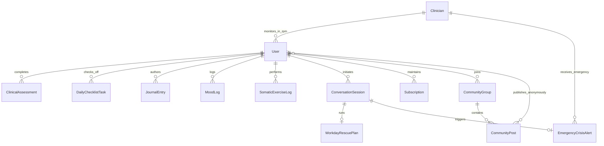

# FriendnPal & OurPadi — Data Structure Specification

**Project:** FriendnPal Mental Health Ecosystem (OurPadi Mobile App + Clinician RPM Dashboard)  
**Document:** `data-structure.md`  
**Version:** 2.1.0  
**Baseline:** `requirements.md` (v2.1.0), `user-flow.md` (v2.0.0) & `screen-specification.md`  
**Methodology:** **Prediction $\rightarrow$ Prevention $\rightarrow$ Proactive Intervention**

---

## Overview

This document provides a plain, comprehensive list of every **"thing" (entity)** the FriendnPal ecosystem must remember across the **OurPadi mobile client** (iOS / Android), the **backend predictive engine**, and the **FriendnPal Clinician Remote Patient Monitoring (RPM) Dashboard**, including peer support communities, daily motivational checklists, mental health resource libraries, mindfulness/ASMR soundscapes, private journals, and continuous mood check-ins.

---

## 1. Patient Profile (`User`)
* **What it is:** The individual using OurPadi (e.g., student, corporate employee, addiction recovery seeker, or nocturnal Upwork freelancer like Amina).
* **Why the system must remember it:** To authenticate identity across mobile and web platforms, personalize AI de-escalation tone (English vs. Nigerian Pidgin), assign the user to a clinical care cohort and peer communities, and manage subscription access.
* **Facts / Fields to store:**
  * `user_id`: Unique identifier (UUID). *Example: `usr_8241a7c2`*
  * `client_platform`: Primary client application (`OURPADI_IOS`, `OURPADI_ANDROID`, `WHATSAPP_AUXILIARY`).
  * `phone_number`: Mobile phone number in international format. *Example: `+2348012345678`*
  * `email`: User's contact email. *Example: `amina.freelance@gmail.com`*
  * `display_name`: Preferred pseudonym or community alias. *Example: `"Amina"`*
  * `preferred_language`: Dialect preference (`NIGERIAN_ENGLISH` or `NIGERIAN_PIDGIN`).
  * `city_location`: Primary city location. *Example: `"Garki, Abuja"`*
  * `occupation_category`: Category (`REMOTE_FREELANCER`, `CORPORATE_EMPLOYEE`, `STUDENT`, `OTHER`).
  * `joined_community_ids`: Array of IDs of peer communities joined.
  * `assigned_clinician_id`: Links to managing clinician on RPM Dashboard.
  * `current_risk_tier`: Active clinical tier (`NORMAL`, `MODERATE_AT_RISK`, `HIGH_RISK`, `CRITICAL`).
  * `account_status`: Status (`TRIAL`, `ACTIVE_SUBSCRIBER`, `PAST_DUE`, `CRISIS_SUSPENDED`).
  * `created_at`: Registration timestamp.

---

## 2. Clinician Profile (`Clinician`)
* **What it is:** A certified therapist, clinical psychologist, or care manager operating on the FriendnPal Clinician RPM Dashboard.
* **Why the system must remember it:** To manage provider authentication, route caseload alerts, track clinical interventions, and schedule virtual therapy sessions.
* **Facts / Fields to store:**
  * `clinician_id`: Unique clinician identifier. *Example: `cln_31b089e4`*
  * `full_name`: Official clinician name and credentials. *Example: `"Dr. Chidi Okafor, M.Sc., MNPA"`*
  * `license_number`: Verified Nigerian medical/psychological council registration.
  * `clinical_specialty`: Specialty focus (`ANXIETY_BURNOUT`, `DEPRESSION`, `ADDICTION_RECOVERY`, `TRAUMA_CRISIS`).
  * `on_call_status`: Current crisis availability (`ACTIVE_ON_CALL`, `OFF_DUTY`, `IN_SESSION`).
  * `emergency_hotline_phone`: Dedicated on-call phone number for WhatsApp crisis links (`wa.me/...`).
  * `assigned_cohort_ids`: List of patient cohorts overseen.
  * `max_caseload`: Maximum monitoring quota.

---

## 3. Standardized Clinical Assessment (`ClinicalAssessment`)
* **What it is:** Standardized longitudinal mental health screenings completed in OurPadi (WHO-5, GAD-7, PHQ-9).
* **Why the system must remember it:** Implements **Prediction $\rightarrow$ Prevention** (`FR-03`, `FR-04`), feeding longitudinal score curves into the Clinician RPM Dashboard to identify declining trajectories before crisis points.
* **Facts / Fields to store:**
  * `assessment_id`: Unique assessment record identifier.
  * `user_id`: Links to Patient Profile.
  * `assessment_type`: Framework used (`WHO_5_WELLBEING`, `GAD_7_ANXIETY`, `PHQ_9_DEPRESSION`).
  * `raw_score`: Total score calculated from item responses. *Example: `9` (out of 25 for WHO-5)*
  * `normalized_score`: Standardized metric on a 0–100 scale. *Example: `36.0`*
  * `severity_category`: Diagnostic bracket (`OPTIMAL`, `MILD_STRAIN`, `MODERATE_DEPRESSION`, `SEVERE_ANXIETY`).
  * `answers_json`: Full JSON array of question IDs and selected Likert ratings.
  * `delta_7d_percentage`: Velocity of change compared to 7 days prior. *Example: `-32.0%`*
  * `submitted_at`: Timestamp of completion.

---

## 4. Peer Support Community Group (`CommunityGroup`)
* **What it is:** A moderated anonymous peer support community accessible from the bottom taskbar.
* **Why the system must remember it:** Implements `FR-12` to provide safe spaces for shared lived experience (e.g. Parental Abuse, Addiction, Student Pressure).
* **Facts / Fields to store:**
  * `community_id`: Unique community identifier. *Example: `com_parental_abuse`*
  * `title`: Community name (`"Parental Abuse Support Group"`, `"Addiction & Recovery Support"`, `"Student Stress & Exams"`, `"Freelancers & Burnout"`).
  * `description`: Safety guidelines, community purpose, and ground rules.
  * `category`: Tag (`TRAUMA`, `SUBSTANCE_RECOVERY`, `ACADEMIC`, `OCCUPATIONAL`).
  * `moderator_id`: Assigned community safety monitor.
  * `member_count`: Total active anonymous participants.
  * `is_anonymous_posting_enforced`: Boolean flag enforcing pseudonym privacy.

---

## 5. Community Post & Peer Comment (`CommunityPost`)
* **What it is:** An anonymous discussion post or supportive reply shared within a peer support group.
* **Why the system must remember it:** To allow users to share coping stories, read empathetic responses, and ask questions without judgment.
* **Facts / Fields to store:**
  * `post_id`: Unique post identifier.
  * `community_id`: Links to Community Group.
  * `user_id`: Links to Patient Profile (masked with alias).
  * `author_alias`: Anonymous screen name. *Example: `"Warrior94"`*
  * `post_content`: Narrative post body.
  * `support_reactions_count`: Number of "You are not alone" taps.
  * `flagged_for_moderation`: Boolean flag if harmful content is suspected.
  * `created_at`: Post timestamp.

---

## 6. Daily Motivational Checklist Item (`DailyChecklistTask`)
* **What it is:** A structured daily self-care habit or affirmation prompt for user well-being.
* **Why the system must remember it:** Implements `FR-09` to help users build positive momentum and track daily small wins.
* **Facts / Fields to store:**
  * `task_id`: Unique task item identifier.
  * `user_id`: Links to Patient Profile.
  * `task_date`: Scheduled date for the task.
  * `title`: Habit name (*"Drink 2 glasses of water"*, *"Write 1 thing you are grateful for"*, *"Repeat daily affirmation"*, *"Take 5 deep breaths"*).
  * `category`: Type (`HYDRATION`, `MINDFULNESS`, `AFFIRMATION`, `PHYSICAL_MOVEMENT`).
  * `is_completed`: Boolean flag (`true`/`false`).
  * `completed_at`: Completion timestamp.

---

## 7. Thought & Gratitude Journal Entry (`JournalEntry`)
* **What it is:** A private, encrypted personal journal entry written by the user in OurPadi.
* **Why the system must remember it:** Implements `FR-13` to enable emotional release, cognitive reframing, and gratitude logging.
* **Facts / Fields to store:**
  * `journal_id`: Unique journal identifier.
  * `user_id`: Links to Patient Profile.
  * `entry_title`: User-defined heading or prompt title. *Example: `"Late Night Generator Anxiety"`*
  * `body_text`: Encrypted private reflection text.
  * `entry_type`: Format (`FREEFORM`, `GRATITUDE_PROMPT`, `COGNITIVE_REFRAME`, `VENTING`).
  * `sentiment_tag`: Selected emotion (`CALM`, `HEAVY`, `FRUSTRATED`, `HOPEFUL`).
  * `is_private_encrypted`: Boolean ensuring zero unencrypted sharing.
  * `created_at`: Entry timestamp.

---

## 8. Mental Health Resource Library Article (`ResourceLibraryArticle`)
* **What it is:** A curated psychoeducation article, self-care guide, or crisis coping tip in OurPadi.
* **Why the system must remember it:** Implements `FR-14` to give users quick access to evidence-based mental health education.
* **Facts / Fields to store:**
  * `article_id`: Unique resource article identifier.
  * `title`: Article title. *Example: `"How to Ground Yourself During a Sudden Panic Attack"`*
  * `topic_tag`: Subject (`PANIC_DISORDER`, `DEPRESSION_COPING`, `PARENTAL_TRAUMA`, `ADDICTION_TRIGGERS`).
  * `estimated_read_time_mins`: Reading duration. *Example: `3`*
  * `content_markdown`: Formatted educational content.
  * `author_clinician_id`: Vetted by certified clinical specialist.
  * `bookmarked_by_user`: Boolean flag indicating user saved article.

---

## 9. ASMR Track & Calming Soundscape (`ASMRTrack`)
* **What it is:** A curated high-quality audio file designed for nocturnal decompression, relaxation, and sleep aid.
* **Why the system must remember it:** Implements `FR-11` to provide non-verbal somatic calming tools during midnight stress.
* **Facts / Fields to store:**
  * `track_id`: Unique audio track identifier.
  * `title`: Soundscape name (*"Midnight Abuja Rainstorm"*, *"Gentle Ocean Swell"*, *"Soft Whispered Affirmations"*, *"Binaural Theta Waves"*).
  * `category`: Type (`NATURE_SOUNDS`, `WHISPERED_ASMR`, `BINAURAL_BEATS`, `WHITE_NOISE`).
  * `duration_seconds`: Track length (e.g. `1800` for 30 minutes).
  * `audio_stream_url`: High-compression, low-bandwidth audio stream URL.
  * `play_count`: Usage telemetry metric.

---

## 10. Mindfulness & Somatic Exercise Record (`SomaticExerciseLog`)
* **What it is:** Record of structured somatic exercises completed (4-4-4 box breathing, progressive muscle relaxation, 5-4-3-2-1 grounding).
* **Why the system must remember it:** Implements `FR-10` to log physical de-escalation velocity and update the Clinician RPM Dashboard.
* **Facts / Fields to store:**
  * `exercise_id`: Unique exercise record identifier.
  * `user_id`: Links to Patient Profile.
  * `technique`: Exercise type (`BOX_BREATHING_444`, `SENSORY_GROUNDING_54321`, `PROGRESSIVE_MUSCLE_RELAXATION`).
  * `initial_distress_rating`: Pre-exercise panic rating (1–5 scale).
  * `final_distress_rating`: Post-exercise panic rating (1–5 scale).
  * `cycles_completed`: Number of breathing cycles finished.
  * `completed_at`: Completion timestamp.

---

## 11. Conversation Session (`ConversationSession`)
* **What it is:** An active conversational thread between the user and Padi (AI Companion).
* **Why the system must remember it:** Preserves state across network blackouts so users never reset mid-panic.
* **Facts / Fields to store:**
  * `session_id`: Unique session identifier.
  * `user_id`: Links to Patient Profile.
  * `current_mode`: Active branch (`IDLE`, `TRIAGE_ROUTING`, `SOMATIC_BOX_BREATHING`, `WORKDAY_RESCUE`, `CRISIS_LOCKED`).
  * `current_sub_step`: Step inside active branch.
  * `is_locked_for_crisis`: Halts bot automation during emergency crisis card display (`FD-01`).
  * `session_start_time`: Session initialization timestamp.

---

## 12. Workday Rescue Plan (`WorkdayRescuePlan`)
* **What it is:** Operational deconstruction of an impending work deliverable into 15-minute micro-sprints.
* **Why the system must remember it:** Implements `FR-06` to enforce timeboxed sprints, maintain focus boundaries, and protect livelihoods.
* **Facts / Fields to store:**
  * `plan_id`: Unique rescue plan identifier.
  * `user_id`: Links to Patient Profile.
  * `client_deadline`: Due date and time.
  * `assignment_scope`: Summary of deliverable.
  * `total_sprints_planned`: Number of planned 15-minute intervals.
  * `completed_sprints`: Number of intervals finished.
  * `final_outcome`: Workday result (`SAVED_ON_TIME`, `SUBMITTED_LATE`, `ABANDONED`).

---

## 13. Emergency Crisis Alert (`EmergencyCrisisAlert`)
* **What it is:** Critical safety record generated when a user confirms active self-harm or acute emergency.
* **Why the system must remember it:** Implements `FD-01`, `FD-02`, and `FR-05`, sounding real-time alerts on the Clinician RPM Dashboard.
* **Facts / Fields to store:**
  * `alert_id`: Unique emergency alert identifier.
  * `user_id`: Links to Patient Profile.
  * `severity_level`: Clinical severity (`CRITICAL_IMMINENT`, `HIGH_DISTRESS`).
  * `trigger_lexicon_matches`: Danger keywords matched.
  * `crisis_card_url_served`: Direct WhatsApp click-to-chat URL (`wa.me/...`).
  * `hotline_number_served`: Phone hotline displayed (`+234-800-FRIENDNPAL`).
  * `notified_clinician_id`: Links to on-call Clinician alerted.
  * `created_at`: Incident trigger timestamp.

---

## 14. Daily Mood & Shift Check-in (`MoodLog`)
* **What it is:** Routine post-shift or daily mood check-in entry.
* **Why the system must remember it:** Implements `FR-08` to track emotional valence and correlate with environmental triggers.
* **Facts / Fields to store:**
  * `mood_log_id`: Unique mood entry identifier.
  * `user_id`: Links to Patient Profile.
  * `log_date`: Entry date.
  * `mood_rating`: Selected emotion (`RELIEVED`, `EXHAUSTED`, `ANXIOUS`, `DEFEATED`, `HOPEFUL`).
  * `stress_triggers`: Array of tags (`["POWER_BLACKOUT", "CLIENT_REJECTION", "PARENTAL_STRAIN"]`).
  * `logged_at`: Log timestamp.

---

## 15. Discreet Subscription (`Subscription`)
* **What it is:** The recurring 5,000 NGN/month membership record.
* **Facts / Fields to store:**
  * `subscription_id`: Unique billing record identifier.
  * `user_id`: Links to Patient Profile.
  * `amount_naira`: 5000 NGN.
  * `discreet_statement_descriptor`: Bank statement label: `"FNP Services"`.
  * `subscription_status`: State (`TRIAL`, `ACTIVE`, `FAILED`, `CANCELLED`).

---

## 16. Entity Relationship Diagram (ERD)

