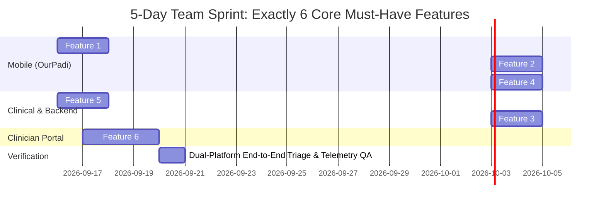

# FriendnPal & OurPadi — Final MoSCoW Feature Prioritization

**Project:** FriendnPal Mental Health Ecosystem (OurPadi Mobile App + Clinician RPM Dashboard)  
**Document:** `final-feature-list.md`  
**Version:** 2.2.0  
**Baseline:** `requirements.md` (v2.1.0) & `screen-specification.md` (v2.2.0)  
**Target Build Scope:** 5-Day Team Sprint  
**Must-Have Constraint:** Exactly 6 Features Maximum (Strictly enforced for a 5-day team build)

---

## 1. Executive Summary & Sprint Scope Boundary

To deliver a production-grade, clinically sound dual-platform prototype within a **5-day team sprint**, the complete feature set derived from `requirements.md` and `screen-specification.md` is prioritized using the **MoSCoW framework**:

* **Must Have (6 Features Maximum):** The irreducible core loop required for a functioning dual-platform ecosystem:
  1. OurPadi Mobile Shell & AI Companion Triage (Screens 1 & 3 / FR-01, FR-02)
  2. Acute Somatic Reset & Sensory Grounding (Screen 4 / FR-10)
  3. Emergency Crisis Handoff Protocol & Crisis Card (Screen 5 / FR-05, FD-01, FD-02)
  4. Workday Rescue 15-Minute Sprint Engine (Screen 6 / FR-06)
  5. Clinical Assessment Intake Engine — WHO-5 (Screen 2 / FR-03)
  6. Clinician RPM Caseload & Alert Dashboard (Screen 8 / FR-07)
* **Should Have (8 Features):** High-value engagement, retention, and diagnostic depth tools (Predictive trajectory analytics, Peer communities, Private journals, ASMR soundscapes, Resource library, Mood check-ins, Daily checklists, Biometric authentication).
* **Could Have (5 Features):** Commercial and auxiliary extensions (Discreet Paystack billing, Human therapy booking, WhatsApp low-bandwidth gateway, Weekly digests, Sprint history).
* **Won't Have (7 Items - This Build):** Explicitly barred for ethics, safety, feasibility, and clinical boundaries (32 language expansion, synthetic voice calling bots, background device surveillance, bundled free therapy in the 5k tier, psychiatric pharmacy prescriptions, autonomous mode-guessing without user taps, live chat hijacking).

---

## 2. Comprehensive MoSCoW Feature Table

| Feature | Description | MoSCoW Category | Reason |
| :--- | :--- | :--- | :--- |
| **OurPadi Mobile Shell & AI Companion Triage (Screens 1 & 3)** | Cross-platform mobile client (iOS/Android) with offline resilience, bottom navigation, culturally fluent AI companion (Nigerian English & Pidgin), and explicit 2-button triage routing (`[Calm My Panic]` vs `[Rescue My Deadline]`). | **Must have** | **Core Entrypoint & Triage Gateway:** The product is completely broken without a patient mobile interface to log in, communicate acute distress, and route immediately to crisis tools (`FD-03`). |
| **Acute Somatic Reset & Sensory Grounding (Screen 4)** | Paced 4-4-4 box breathing gauge with animated visual expanding/contracting circle, synchronized device haptics, 5-4-3-2-1 room sensory grounding inputs, and a post-exercise 1–5 distress slider. | **Must have** | **Clinical De-escalation Core:** Halts acute hyperventilation, racing heart, and cognitive freeze within 10 minutes, fulfilling the primary physiological recovery mandate. |
| **Emergency Crisis Handoff Protocol & Crisis Card (Screen 5)** | Automated safety engine scanning for explicit self-harm keywords, direct confirmation check (`FD-02`), chat lockdown, and high-visibility crisis card serving direct WhatsApp link (`wa.me/...`) and 24/7 hotline (`FD-01`). | **Must have** | **Non-Negotiable Safety Net:** A digital mental health app without an immediate human crisis handoff is clinically unsafe, legally unviable, and poses catastrophic liability during suicidal ideation. |
| **Workday Rescue 15-Minute Sprint Engine (Screen 6)** | Operational deadline salvage engine that deconstructs overwhelming deliverables into structured 15-minute micro-sprints with a digital countdown timer, single-rule constraint card, and local draft submission box. | **Must have** | **Core Beachhead Value Proposition:** Directly halts task freeze for remote freelancers and workers, protecting income and contracts (the primary validation metric for the beachhead persona). |
| **Clinical Assessment Intake Engine — WHO-5 (Screen 2)** | Standardized 5-question WHO-5 Well-Being Index questionnaire with Likert selection cards (0–5 pts), automated score normalization (0–100 scale), and secure backend telemetry dispatch. | **Must have** | **Longitudinal Predictive Foundation:** Without standardized quantitative screening data, the platform cannot establish a patient well-being baseline or drive Remote Patient Monitoring (RPM). |
| **Clinician RPM Caseload & Alert Dashboard (Screen 8)** | Secure web portal for licensed therapists displaying active patient caseload metrics, real-time risk tier badges (`NORMAL`, `MODERATE`, `CRITICAL`), and audio-visual emergency alert banners. | **Must have** | **RPM Ecosystem Mandate:** The system is pointless as a Remote Patient Monitoring platform without provider-facing cohort monitoring and real-time crisis triage visibility. |
| **Predictive Trajectory Analytics & 30-Day Trend Chart (Screen 8)** | Automated background analytics engine that calculates 14-day rolling score trajectories, detects velocity drops (>30% decline), and renders an interactive WHO-5 vs GAD-7 multi-line SVG trend chart. | **Should have** | **Diagnostic Depth:** Enhances clinician trend visibility; however, multi-week mathematical trajectory curves require 14+ days of patient history that does not exist on Day 1–5 of a new sprint. |
| **Peer Support Communities on Taskbar (FR-12)** | Moderated anonymous discussion groups categorized by lived experience: Parental Abuse Support Group, Addiction & Recovery Group, Student Support Group, Freelancers/Burnout Group. | **Should have** | **Stigma Reduction & Connection:** Crucial for long-term community retention; non-essential for acute 3:15 AM physiological panic de-escalation, making it an ideal candidate for Sprint 2. |
| **Private Thought & Gratitude Journals (FR-13)** | Client-side encrypted in-app journal supporting freeform venting, guided gratitude prompts, sentiment tagging, and cognitive reframing history. | **Should have** | **Therapeutic Depth:** Encourages emotional processing; an acutely panicking nocturnal worker needs active box breathing and sprints, not a blank journaling space. |
| **Curated ASMR Soundscapes & Audio Player (Screen 4 / FR-11)** | Curated offline synthesized relaxing soundscapes (Abuja Midnight Rain, Deep Atlantic Waves, Nocturnal Brown Noise) with a 15-minute sleep timer. | **Should have** | **Non-Verbal Calming:** Provides nocturnal comfort and sleep onset; secondary to active somatic box breathing, which already successfully normalizes respiration. |
| **Mental Health Psychoeducation Resource Library (FR-14)** | Searchable repository of psychoeducational articles, clinical self-help guides, trauma boundary setting articles, and practical mental health tips. | **Should have** | **Psychoeducation:** Equips users with self-guided coping literacy; static markdown articles can be integrated immediately after core triage mechanics are verified. |
| **Continuous Mood Check-ins & Shift-End Logging (Screens 1 & 7 / FR-08)** | Quick-tap mood logging with emotion wheel (`[Relieved]`, `[Calm]`, `[Exhausted]`, etc.) and post-shift transition logging with milestone confirmation. | **Should have** | **Behavioral Tracking:** Supplies valuable subjective data to correlate with clinical scores; app still functions without real-time mood logging on Day 1. |
| **Daily Motivational Checklist & Wellness Habits (Screen 1 / FR-09)** | Interactive daily habit checklist featuring positive affirmations, hydration tracking, mindfulness prompts, and self-care milestone badges. | **Should have** | **Daily Habit Retention:** Drives daily active engagement; secondary to the core acute de-escalation loop. |
| **Biometric Authentication & Local Data Encryption (FR-01)** | Face/fingerprint scanner modal protecting stored mental health telemetry, clinical notes, and assessment history on the mobile device. | **Should have** | **Data Privacy:** Essential for production deployment; during a 5-day team prototype, standard OS device passcodes provide temporary privacy protection. |
| **Discreet Paystack / Flutterwave Billing (Screen 7 / FR-16)** | Recurring 5,000 NGN/month subscription processing with discreet bank statement descriptors ("FNP Services") and automated payment webhook listeners. | **Could have** | **Commercial Integration:** Product can run on a 7-day or 14-day free trial during sprint validation; live payment gateways can be finalized prior to public launch. |
| **Human Therapy Marketplace Booking (FR-15)** | In-app directory to browse certified Nigerian therapists, select calendar slots, and pay session fees (7,500–15,000 NGN) for 45-min virtual video consultations. | **Could have** | **Secondary Revenue Channel:** Emergency counselor handoff is already solved in Must-Have via the free direct WhatsApp counselor link (`wa.me/...`). |
| **WhatsApp Low-Bandwidth Auxiliary Gateway (FR-17)** | Auxiliary Meta Cloud API webhook gateway providing a lightweight text/button interface for users experiencing extreme 2G throttling or mobile data depletion. | **Could have** | **Auxiliary Redundancy:** The native OurPadi mobile app already caches box breathing and sprint timers offline; a third-party WhatsApp bot is a secondary fallback. |
| **Weekly Longitudinal Mental Health Digest (FR-18)** | Automated weekly summary email or push notification highlighting mood stability, score trends, and environmental stress correlations. | **Could have** | **Nice to Have:** Adds ongoing reflection value, but does not impact real-time acute crisis de-escalation during a 5-day test window. |
| **Multi-Sprint History & Deliverable Archive (Screen 6)** | Persistent log of past completed sprint deliverables, word counts, and total client contract value protected. | **Could have** | **Productivity Proof:** Great for user motivation; single active sprint state tracking in local cache is sufficient for initial validation. |
| **32 Nigerian & African Language Expansion (FR-19)** | NLP model localization and dialect datasets across 32 regional African languages. | **Won't have (this build)** | **Scope Boundary:** Sprint focuses strictly on Standard Nigerian English and Nigerian Pidgin; multilingual expansion requires extensive corpus training post-scale. |
| **Synthetic AI Voice Calling Bot (FR-20)** | Outbound or inbound speech-to-speech synthetic phone calling bot. | **Won't have (this build)** | **Bandwidth & Privacy:** High network latency under Nigerian telecom networks, high compute costs, and severe privacy concerns in thin-walled shared apartments. |
| **Invasive Background Device Surveillance (FR-21)** | Background keystroke logging, ambient microphone listening, or continuous GPS surveillance. | **Won't have (this build)** | **Trust & Ethics:** Strictly barred to protect patient trust, preserve mobile battery life, and comply with the Nigerian Data Protection Regulation (NDPR). |
| **Bundled Free Human Therapy in 5,000 NGN Tier** | Unlimited human therapy consultations bundled inside the base monthly subscription. | **Won't have (this build)** | **Unit Economics:** Private clinical rates (7,500–15,000 NGN/session) make bundled human sessions unviable at 5,000 NGN/mo. Human therapy remains pay-per-session. |
| **Medical Prescriptions & Clinical Pharmacy Delivery** | Pharmacological management, e-prescriptions, or delivery of antidepressant/anxiolytic medications. | **Won't have (this build)** | **Regulatory Boundary:** FriendnPal is a digital triage and Remote Patient Monitoring platform, not a licensed psychiatric dispensary. |
| **Autonomous Mode-Guessing without User Tap (FD-03)** | Algorithmic guessing of whether to run breathing vs. deadline rescue based purely on freeform conversational text. | **Won't have (this build)** | **Founder Decision (FD-03):** Barred to avoid misinterpreting distress and frustrating panicking users; mode routing is strictly driven by explicit user taps. |
| **Live Mid-Chat Counselor Hijacking (FD-01)** | Multi-agent live chat switching where a human counselor silently takes over the active bot thread. | **Won't have (this build)** | **Founder Decision (FD-01):** Unreliable under erratic mobile network drops; emergency handoff is cleanly routed via direct WhatsApp links (`wa.me/...`). |

---

## 3. Scope Management & Cut Justifications (Enforcing the 6 Must-Have Limit)

To strictly satisfy the **5–6 feature maximum cap for a 5-day team build**, candidate features were evaluated against the criterion: *"Is the dual-platform clinical loop broken or pointless without it?"* 

If more than 6 qualified, the following features were cut first from the Must-Have list and placed into **Should-Have**:

### 1. Cut #1: Predictive Trajectory Analytics & 30-Day Trend Curve (Screen 8 / FR-04)
* **What it does:** Calculates 14-day score velocities (>30% drop) and renders multi-line SVG curves comparing WHO-5 and GAD-7.
* **Why cut first:** A 5-day team build lacks multi-week historical patient data. Clinicians can effectively triage incoming patients on Day 1–5 using the raw WHO-5 score (e.g., 36/100) and risk tier badge (`MODERATE` / `CRITICAL`) without needing full historical trend regression curves.

### 2. Cut #2: Peer Support Communities on Taskbar (FR-12)
* **What it does:** Provides 4 anonymous group forums (Parental Abuse, Addiction Recovery, Student Stress, Freelancers) with reactions and threads.
* **Why cut second:** Group messaging, access control, and real-time moderation require extensive backend database schemas and security filters. While excellent for long-term community retention, an isolated user experiencing a 3:15 AM crisis needs personal physiological de-escalation, not a forum.

### 3. Cut #3: Private Thought & Gratitude Journals (FR-13)
* **What it does:** Private AES-encrypted journaling with sentiment tagging and guided reflection prompts.
* **Why cut third:** A user hyperventilating under an acute deadline freeze will use **Somatic Box Breathing** (Screen 4) and **Workday Rescue** (Screen 6), not a reflective journaling prompt. Journaling is non-critical for acute crisis stabilization and can be delivered in Sprint 2.

### 4. Cut #4: Curated ASMR Soundscapes & Audio Player (Screen 4 / FR-11)
* **What it does:** Offline Web Audio synthesis of rain, ocean waves, and brown noise with a sleep timer.
* **Why cut fourth:** The visual and haptic 4-4-4 box breathing gauge already normalizes breathing without requiring audio synthesis engines, sound libraries, or media players.

### 5. Cut #5: Daily Motivational Checklist & Wellness Habits (Screen 1 / FR-09)
* **What it does:** Interactive checklist with progress bars, water intake tracking, and affirmation checkboxes.
* **Why cut fifth:** Daily self-care habits represent a secondary retention mechanism. A user in severe burnout or acute panic will not be saved by checking off a water glass habit.

### 6. Cut #6: Mental Health Psychoeducation Resource Library (FR-14)
* **What it does:** Searchable repository of clinical coping guides and trauma boundary articles.
* **Why cut sixth:** Passive reading does not resolve an active 3:00 AM panic attack or salvage a deadline. Articles can be dropped into the project as static markdown files post-sprint.

---

## 4. The 5-Day Sprint Implementation Blueprint

