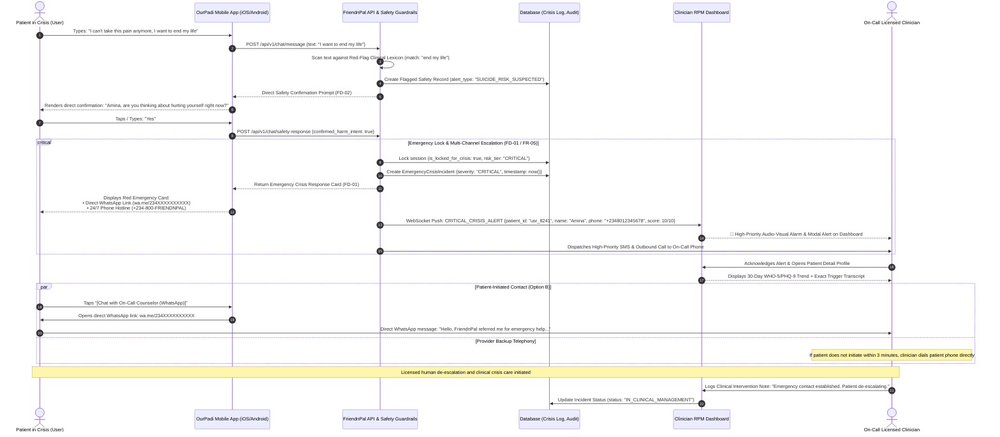

# FriendnPal & OurPadi — Sequence Diagrams

**Project:** FriendnPal Mental Health Ecosystem (OurPadi Mobile App + Clinician RPM Dashboard)  
**Document:** `sequence-diagram.md`  
**Version:** 2.0.0  
**Baseline:** `requirements.md` (v2.0.0) & `user-flow.md` (v2.0.0)  
**Methodology:** **Prediction $\rightarrow$ Prevention $\rightarrow$ Proactive Intervention**

---

## 1. Main Flow: Longitudinal Prediction, Acute De-escalation & RPM Telemetry Sync

This diagram illustrates how data moves across the complete ecosystem during both the **predictive routine intake** and the **acute midnight de-escalation and workday rescue session**, concluding with real-time telemetry synchronization to the **FriendnPal Clinician RPM Dashboard**.

### Participants:
* **User:** Patient / Gig Worker (Amina)
* **OurPadi App:** Cross-Platform Mobile Client (iOS / Android v2.1.0)
* **API / Backend:** FriendnPal API Server & Predictive Analytics Engine
* **DB:** Core Database (Users, Longitudinal Scores, Sessions, Risk Logs)
* **RPM Dashboard:** FriendnPal Clinician Web Portal
* **Clinician:** Licensed Therapist / Clinical Care Team

```mermaid
sequenceDiagram
    autonumber
    actor User as Patient (User)
    participant App as OurPadi Mobile App (iOS/Android)
    participant API as FriendnPal API & Predictive Engine
    participant DB as Database (Profiles, Scores, Risk)
    participant RPM as Clinician RPM Dashboard
    actor Clinician as Licensed Clinician

    %% Phase 1: Longitudinal Prediction & Prevention
    rect rgb(15, 23, 42)
    Note over User, Clinician: PHASE 1: Longitudinal Predictive Monitoring (Routine Intake)
    User->>App: Opens OurPadi for evening wind-down
    App-->>User: Prompts weekly 5-question WHO-5 Well-Being Index
    User->>App: Completes WHO-5 assessment (Score: 36/100, -32% vs baseline)
    App->>API: POST /api/v1/assessments {type: "WHO_5", score: 36, answers: [...]}
    API->>DB: Store Assessment & Calculate 14-Day Trajectory Delta
    DB-->>API: Trend: Velocity decline >30% (Risk: MODERATE_AT_RISK)
    API->>RPM: WebSocket Event: patient_risk_updated {patient_id: "usr_8241", tier: "MODERATE", delta: -32}
    RPM-->>Clinician: Flags patient into "Moderate Risk - Prevention Cohort"
    API-->>App: Return Predictive Nudge: [Suggested 3-Min Evening Decompression]
    App-->>User: Displays gentle preventive mental health card
    end

    %% Phase 2: Acute Midnight Crisis & Somatic Reset
    rect rgb(20, 29, 47)
    Note over User, Clinician: PHASE 2: Acute Midnight Trigger & Triage (03:15 AM WAT)
    Note over User: Neighborhood generator dies; client deadline in 3 hrs; brother moaning in pain; hyperventilating
    User->>App: Launches OurPadi & opens Padi Companion chat
    App->>API: POST /api/v1/sessions/start {trigger: "ACUTE_NIGHT_SHIFT"}
    API->>DB: Initialize active session (state: "TRIAGE_ROUTING")
    API-->>App: Empathetic greeting + Quick-Tap Buttons: [Calm My Panic] / [Rescue My Deadline]
    App-->>User: Displays Padi Reassurance & Mode Buttons (FD-03)
    
    User->>App: Taps "[Calm My Panic]"
    App->>API: POST /api/v1/sessions/mode {mode: "SOMATIC_BOX_BREATHING"}
    API->>DB: Update state (state: "SOMATIC_DE_ESCALATION", initial_distress: 5)
    API-->>App: Stream 4-4-4 Box Breathing cadence & 5-4-3-2-1 Sensory prompts
    App-->>User: Renders animated expanding/contracting breathing visual + haptics
    Note over User, App: User performs 3 breathing cycles; heart rate slows
    
    User->>App: Taps "[Heart Rate Slower]" & enters 3 objects ("bottle, charger, blanket")
    User->>App: Rates current anxiety: "2 - Manageable" (down from 5)
    App->>API: POST /api/v1/sessions/log-distress {current_distress: 2, status: "STABILIZED"}
    API->>DB: Log distress reduction (from 5 to 2)
    API->>RPM: WebSocket Event: patient_telemetry {patient_id: "usr_8241", status: "STABILIZED_POST_BREATHING"}
    RPM-->>Clinician: Real-time telemetry: Patient de-escalated successfully (12 mins)
    end

    %% Phase 3: Workday Rescue & Closed-Loop Resolution
    rect rgb(15, 23, 42)
    Note over User, Clinician: PHASE 3: Workday Rescue & Closed-Loop Sync
    App-->>User: Prompts: "Heart rate steady. What deliverable is due at what time?"
    User->>App: Submits scope: "5 email headlines + body copy due at 6:00 AM"
    App->>API: POST /api/v1/rescue/create-plan {deadline: "06:00 WAT", scope: "5 headlines + copy"}
    API->>DB: Generate structured 15-minute micro-sprint plan (4 sprints)
    API-->>App: Return Sprint 1: "Write 3 subject lines only (15 mins)"
    App-->>User: Displays Sprint 1 countdown timer & focus boundary
    
    Note over User, App: User completes Sprint 1, 2, 3, and 4 via structured timeboxes
    User->>App: Submits final work to Upwork & texts: "Done! Submitted on Upwork!" (05:10 AM)
    App->>API: POST /api/v1/rescue/complete {status: "SAVED_ON_TIME", contract_value: 500}
    API->>DB: Close active session (rescue_success: true, final_distress: 1)
    
    API->>RPM: WebSocket Event: patient_resolved {patient_id: "usr_8241", tier: "STABILIZED", outcome: "WORK_SAVED"}
    RPM-->>Clinician: Updates patient curve to Green (Stabilized); logs complete session audit trail
    
    App-->>User: Celebratory card: "🎉 Contract Protected! Shut laptop, hydrate, and rest."
    end
```

---

## 2. Exception Path: Acute Crisis Detection & Urgent RPM Escalation

This sequence diagram illustrates the clinical safety protocol when a user expresses acute suicidal ideation or self-harm intent (`FD-01`, `FD-02`, `FR-04`, `FR-05`), bypassing automated exercises, serving direct emergency contact channels, and alerting the on-call clinician in real time on the **FriendnPal RPM Dashboard**.



---

## 3. Telemetry Event Payloads Summary

| Event Name | Producer | Consumer | Key Data Attributes |
| :--- | :--- | :--- | :--- |
| `WHO5_SCORE_RECORDED` | OurPadi App | API / DB / RPM | `patient_id`, `score` (0–100), `delta_7d`, `risk_tier` (`NORMAL`, `MODERATE`, `HIGH`) |
| `SOMATIC_RESET_START` | OurPadi App | API / DB | `session_id`, `technique` (`BOX_BREATHING_444`), `initial_distress` (1–5) |
| `SOMATIC_RESET_END` | OurPadi App | API / RPM | `session_id`, `duration_seconds`, `final_distress` (1–5), `status` (`STABILIZED`) |
| `WORKDAY_SPRINT_UPDATE` | OurPadi App | API / DB | `sprint_index`, `target_duration_mins`, `task_scope`, `submission_status` |
| `CRITICAL_CRISIS_ALERT` | Safety Engine | RPM / Clinician | `patient_id`, `severity` (`CRITICAL`), `transcript_snippet`, `counselor_phone`, `dispatched_at` |
| `CLINICIAN_INTERVENTION_LOG` | RPM Dashboard | API / DB | `incident_id`, `clinician_id`, `intervention_type` (`WHATSAPP_CHAT`, `VOICE_CALL`), `notes` |
